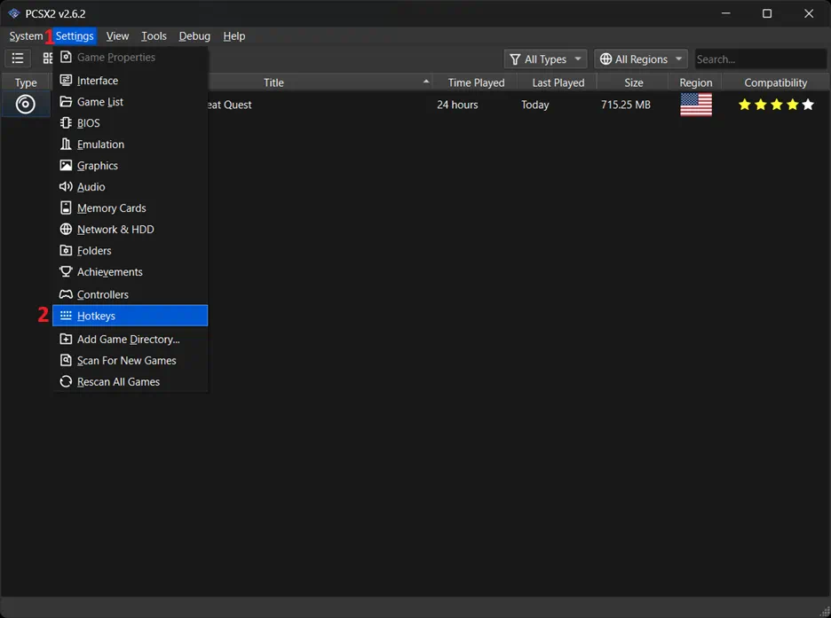
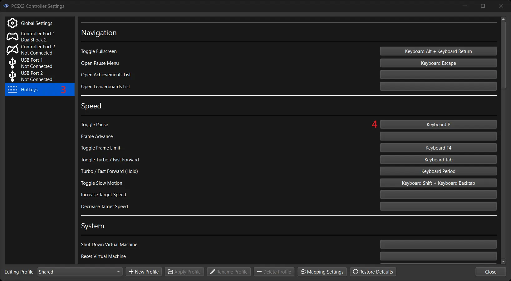
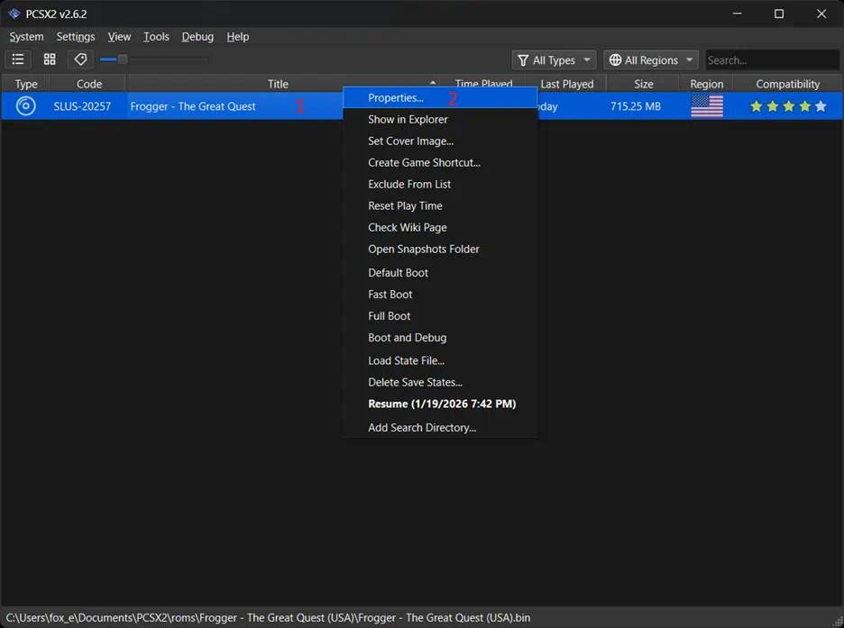
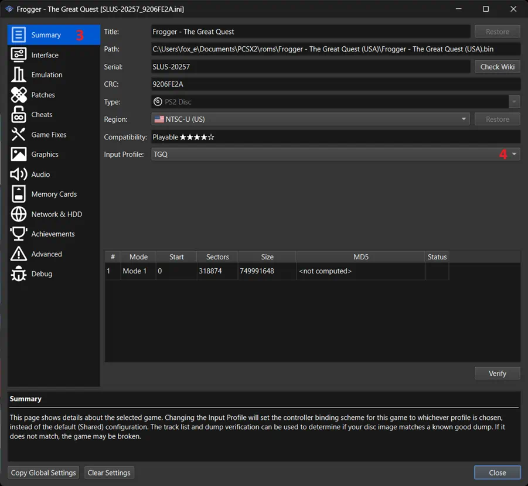

# PS2 Usage

The PS2 version of this mod is designed to be ran on the [PCSX2](https://pcsx2.net) emulator.

* The mod is only tested for PCSX2 v2.6.2, but it may work for other versions.
* It only supports the NTSC version.
* It does not support physical hardware.
* I do not own a game controller, so this has only been tested using keyboard and mouse, with the mouse emulating the right analogue stick.

The following steps assume you can already play the game normally using PCSX2.

After downloading and unzipping the release, all mod files are inside the "PS2" folder.

## Keyboard and Mouse Emulation

If you are using a controller, you can skip this section.

1. This controller map binds the spacebar to X. By default, spacebar pauses the game. We will remap pausing the game to P instead. With no game open, navigate to `Settings > Hotkeys > Speed > Toggle Pause` and change the value from Spacebar to P.

    Hotkeys" style="zoom:50%;" /> Speed > Toggle Pause" style="zoom:50%;" />

2. Load the custom input map into PCSX2 by copying `TGQ.ini` to the input profiles folder of PCSX2, located by default at `%USERPROFILE%/Documents/PCSX2/inputprofiles` on Windows. Restart PCSX2 for the changes to take effect.

3. Set the game to use this input map by right clicking the game from the home screen, then navigating to `Properties... > Summary > Input Profile` and changing it to "TGQ".

    Properties..." style="zoom:50%;" /> Summary > Input Profile" style="zoom:50%;" />

4. Try playing the game with this profile without the mod installed to verify it is bound correctly. The mouse won't do anything yet, not until you install the mod. These are the keybinds I have chosen.

| Keys       | Controller Button    | Actions              |
| ---------- | -------------------- | -------------------- |
| WASD       | Left analogue stick  | Movement             |
| Mouse      | Right analogue stick | Camera Movement      |
| Spacebar   | X                    | Jump / Confirm       |
| Left Click | Square               | Attack               |
| F          | R3                   | Free look            |
| E          | Circle               | Interact             |
| R          | Triangle             | Magic Stone / Cancel |
| Q          | L1                   | Scroll Stones        |
| C          | L2                   | Center Camera        |
| Left Shift | R2                   | Dive                 |
| Left Ctrl  | R1                   | Target / Strafe      |
| Backspace  | Select               | Inventory            |
| Enter      | Start                | Confirm / Pause      |

## Applying the Patch

After getting the game to work with the new keybinds, it is now time to actually apply the patch.

1. Copy the patch file `SLUS-20257_9206FE2A.TGQMouseMod.pnach` to the patches folder of PCSX2, located by default at `%USERPROFILE%/Documents/PCSX2/patches` on Windows.
2. Activate the patch by right clicking the game from the home screen, then navigating to `Properties... > Patches` and ticking the box next to "TGQMouseMod". If it doesn't show up then click the "Reload Patches" button.
3. Launch the game. **Important: The patch will not be applied to any existing save states by default**. You can apply it to existing save states if you go to the patch menu and toggle the checkbox while the game is running. Any save states you create with the patch applied will still be permanently patched after reloading the save state.

